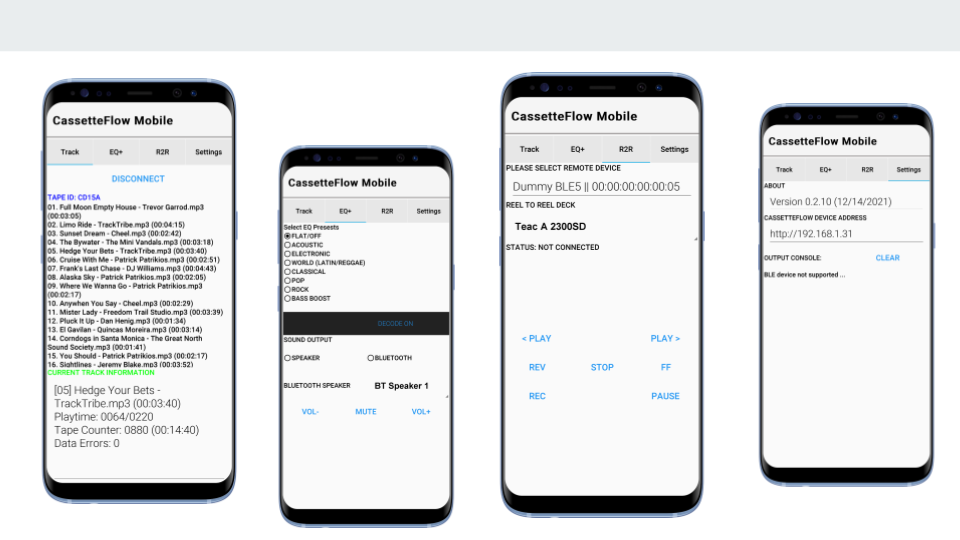

# CassetteFlowOne
A simple [CodenameOne](https://cloud.codenameone.com/) base mobile application 
for connecting to the CassetteFlow system currently under development using the 
[ESP32LyraT](https://github.com/ns96/cassetteflow) audio board and 
[Desktop Java](https://github.com/ns96/cassetteflowJava). It also provides basic
functionality for control of a Teac A-2300SD (and similar) Reel To Reel tape decks

## Installation
Here are the key steps to [Side Load](https://www.digitaltrends.com/mobile/how-to-sideload-an-apk/) the app on Android devices.
